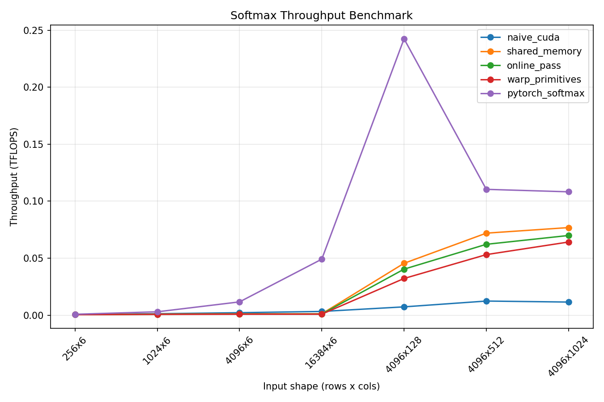
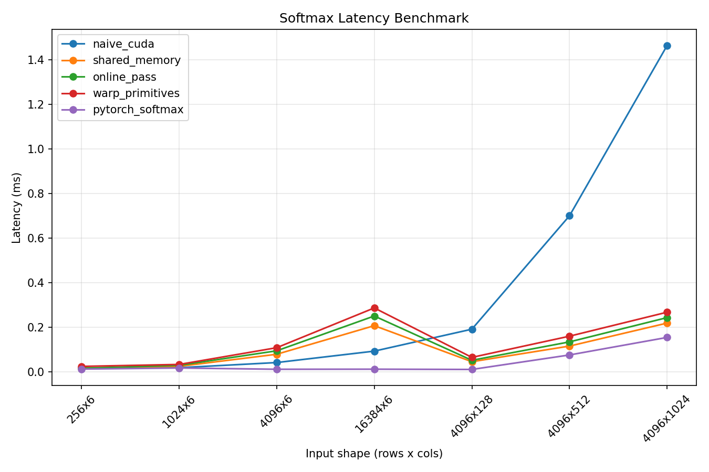
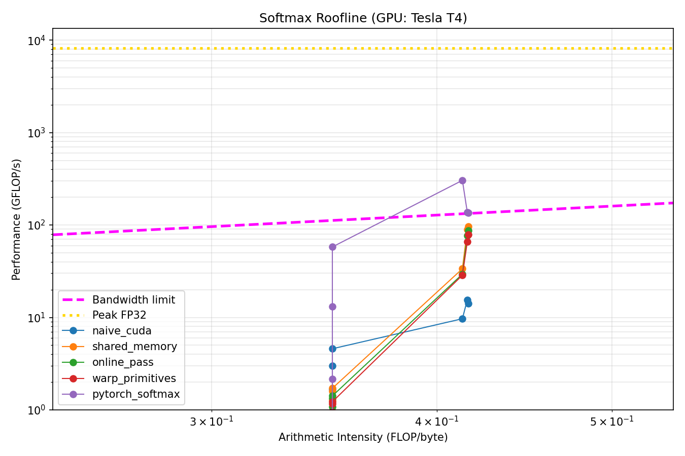

CUDA Softmax Kernels (PyTorch Extension)
========================================

GPU‑optimized softmax kernels implemented in CUDA and exposed as PyTorch C++ extensions. This project is designed to demonstrate hands‑on GPU kernel engineering skills: correctness, performance tradeoffs, and practical integration into a Python ML workflow.

MLP model (`mlp.py`)
-------------------
`models/mlp.py` defines a small fully‑connected network (`HARMLP`) used as a **lightweight integration harness** for the custom softmax kernels. It consists of four linear layers (561 → 256 → 128 → 512 → 6) with ReLU activations and a pluggable `softmax_fn`, which makes it easy to swap between the PyTorch implementation and the custom CUDA extensions.

This model is **not the primary focus of the project**. Its role is to provide a simple, realistic context for correctness and performance checks. The core contribution is the **kernel development and the PyTorch C++ extension work** that exposes those kernels to Python.

Highlights
----------------------
1. Multiple CUDA kernel variants: naive, shared memory, online pass, and warp‑primitive implementations.
2. PyTorch C++ extensions with strict input validation (CUDA, float32, 2D).
3. Correctness tests against `torch.softmax`.
4. Benchmarking harness to compare kernel performance across input sizes.

Kernel variants
---------------
| Variant | Idea | When it matters |
| --- | --- | --- |
| Naive | Baseline implementation for clarity and correctness | Reference and debugging |
| Shared memory | Reduce global memory traffic via shared memory staging | Mid‑size matrices |
| Online pass | Numerically stable softmax in a single pass | Large rows / stability |
| Warp primitives | Warp‑level reductions and shuffles | High performance on modern GPUs |

Correctness & validation
------------------------
The kernels are tested for numerical equivalence against `torch.softmax` using a dedicated test script. Inputs are required to be CUDA tensors, `float32`, and 2D `[rows, cols]` matrices; the C++ bindings enforce these constraints.

Performance results
-------------------
**Throughput**


#### Throughput interpretation

Throughput scales primarily with **problem size and row width**. Small shapes (e.g., 256×6) show extremely low TFLOPS because **kernel launch overhead and under‑utilization dominate**. As `cols` increases to 128–1024, throughput improves and then begins to **plateau**, which is typical for memory‑bound kernels where added work does not proportionally increase effective bandwidth.

Among the custom kernels, **shared_memory > online_pass > warp_primitives > naive** for large widths, reflecting progressively better data reuse and reduced redundant global reads. PyTorch softmax remains the top performer in this T4 setup, which is expected from highly optimized library kernels.

**Latency**


#### Latency interpretation

Latency trends mirror throughput: **small shapes are overhead‑bound**, so different kernels cluster closely. For larger widths, latency grows with total elements, but **shared_memory and online_pass reduce per‑element cost** compared to the naive baseline. The warp‑primitive version performs well but does not surpass the shared‑memory path in these sizes, likely due to limited arithmetic intensity and memory pressure.

PyTorch softmax shows the lowest latency across most shapes, indicating strong kernel tuning and efficient scheduling. The relatively flat latency on small widths is typical when execution time is dominated by fixed launch and synchronization costs rather than arithmetic.

**Roofline**


#### Roofline interpretation

These measurements on a T4 show **very low arithmetic intensity (~0.35–0.42 FLOP/byte)**, which places all kernels firmly in the **memory‑bound** region. That is why the points cluster near the bandwidth ceiling and remain far below the peak FP32 line. The small increase in arithmetic intensity as `cols` grows is expected: fixed per‑row overheads (reductions for max and sum) are amortized over more elements.

Visually, the plot looks “compressed” along the X‑axis and aligned with the sloped bandwidth line because **AI changes only slightly across the tested shapes** and the axes are logarithmic. This is normal for softmax: the operation touches memory multiple times per element and performs only a few arithmetic operations, so it **does not approach the compute‑bound regime**, and the classic roofline “knee” is barely visible in this range. That appearance is expected for T4 and these shapes.

Across kernels, **higher GFLOP/s at similar AI indicates better effective bandwidth use**, not higher compute utilization. The shared‑memory and online‑pass variants deliver the largest gains on wider rows (128–1024), suggesting more efficient global memory access and better reuse within a block. The PyTorch implementation still leads, consistent with vendor‑tuned kernels and stronger fusion/tiling.

How to build
------------
From the repo root:
```bash
python setup.py build_ext --inplace
```

How to run tests
----------------
```bash
python tests/softmax_equivalence_test.py
```

How to run benchmarks
---------------------
```bash
python benchmarks/softmax_bench.py
```

Project structure
-----------------
| Path | Purpose |
| --- | --- |
| `kernels/` | CUDA implementations of each softmax variant |
| `csrc/` | PyTorch C++ extension bindings per kernel |
| `tests/` | Correctness tests vs `torch.softmax` |
| `benchmarks/` | Performance measurement scripts |
| `models/` | Small MLP model used in equivalence testing |
| `triton_deploy/` | Triton Inference Server example |

Architecture & design
---------------------
The project is organized to keep kernel code, bindings, and Python entry points clearly separated. Each CUDA kernel lives in `kernels/*.cu` and is exposed by a matching `csrc/*_bindings.cpp` file that provides a `forward` function to PyTorch. The build system (`setup.py`) compiles each variant into its own extension module, which tests and benchmarks import directly from the repo root.

Data flow:
```
Python (tests/benchmarks/models)
  -> PyTorch C++ extension (csrc/*_bindings.cpp)
    -> CUDA kernel (kernels/*.cu)
```

The `models/HARMLP` class accepts a `softmax_fn` so the model can swap between `torch.softmax` and custom CUDA kernels, enabling correctness and performance comparisons in a realistic workflow.

Triton deployment (Python backend)
----------------------------------
This repo includes a Triton Inference Server model repository at `triton_deploy/softmax_engine_repository`. The Python backend loads the HARMLP model and uses the warp-based softmax extension. The model expects `INPUT` FP32 with shape `[-1, 561]` and returns `OUTPUT` FP32 with shape `[-1, 6]` (see `config.pbtxt`).

1. Build the Triton image:
```bash
docker build -t softmax-triton -f triton_deploy/Dockerfile .
```

2. Run the server:
```bash
docker run --gpus all -p 8000:8000 softmax-triton
```

3. Run the HTTP client from your host:
```bash
pip install tritonclient[http]
python triton_deploy/triton_client.py
```

If you run Triton outside Docker, set `SOFTMAX_ENGINE_REPO=/path/to/repo` so the backend can import the CUDA extension from the repo root.

Roadmap
------------------
1. Add FP16 and BF16 support with correctness tests.
2. Implement fused softmax + attention‑like patterns.
3. Profile kernels with Nsight and document bottlenecks.
